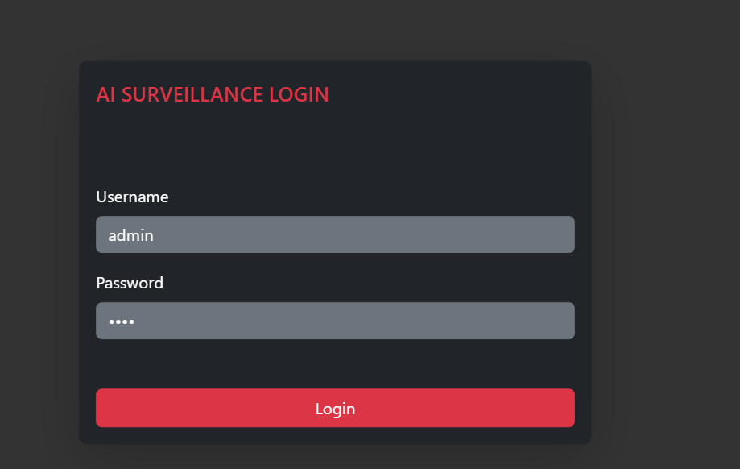
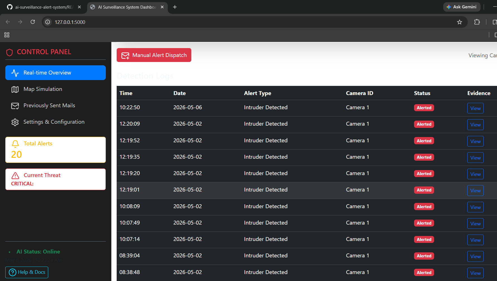
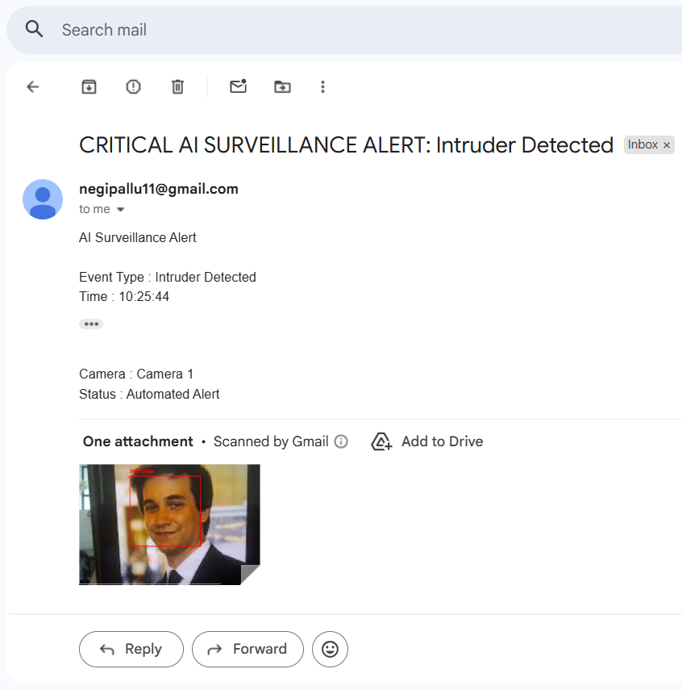
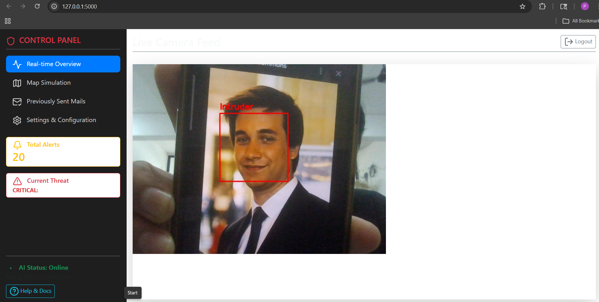
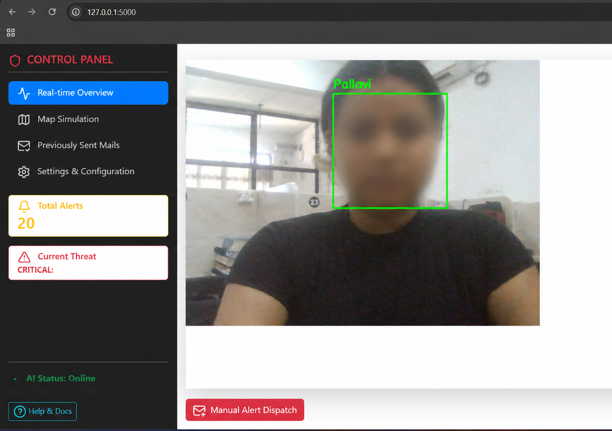
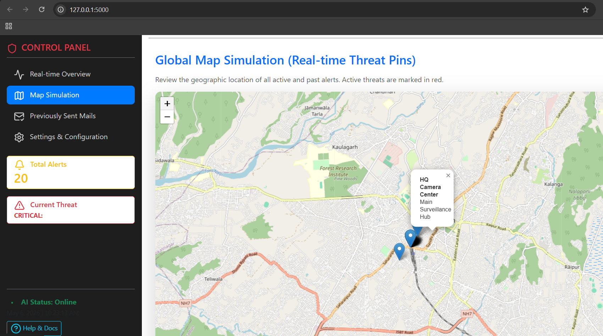

# AI Surveillance Alert System

An AI-powered real-time surveillance and intruder detection system built using YOLOv8, OpenCV, Flask, and SQLite.

The system detects intruders and suspicious objects through a live camera feed, captures snapshots, tracks location data, and sends automated email alerts with Google Maps integration.

---

## Features

- Real-time intruder detection using YOLOv8
- Face recognition support for known users
- Automated email alerts with snapshots
- Live location tracking and Google Maps integration for alert monitoring
- Weapon/object detection support
- Detection logs storage using SQLite and CSV
- Responsive web interface using Flask
- Real-time camera monitoring system

---

## Tech Stack

### Frontend
- HTML
- CSS
- JavaScript

### Backend
- Flask (Python)

### AI / Computer Vision
- YOLOv8
- OpenCV

### Database
- SQLite

---

## Project Structure

```bash
AI_surveillance_System/
│
├── app.py
├── detector.py
├── database.py
├── templates/
├── statics/
├── screenshots/
├── surveillance.db
└── yolov8n.pt
```

---

## How to Run the Project

### 1. Clone the repository

```bash
git clone https://github.com/pallavinegi/ai-surveillance-alert-system.git
```

### 2. Navigate to project folder

```bash
cd ai-surveillance-alert-system
```

### 3. Install dependencies

```bash
pip install -r requirements.txt
```

### 4. Run the application

```bash
python app.py
```

---

## Project Screenshots

### Login Page



### Dashboard



### Alert Mail



### Intruder Detection



### Face Recognition



### Maps Integration



---

## Future Improvements

- Cloud deployment support
- SMS alert integration
- Multi-camera surveillance
- Advanced threat analytics
- Live dashboard monitoring

---

## Author

**Pallavi Negi**

- GitHub: https://github.com/pallavinegi
- LinkedIn: https://linkedin.com/in/pallavi-negi-cse
